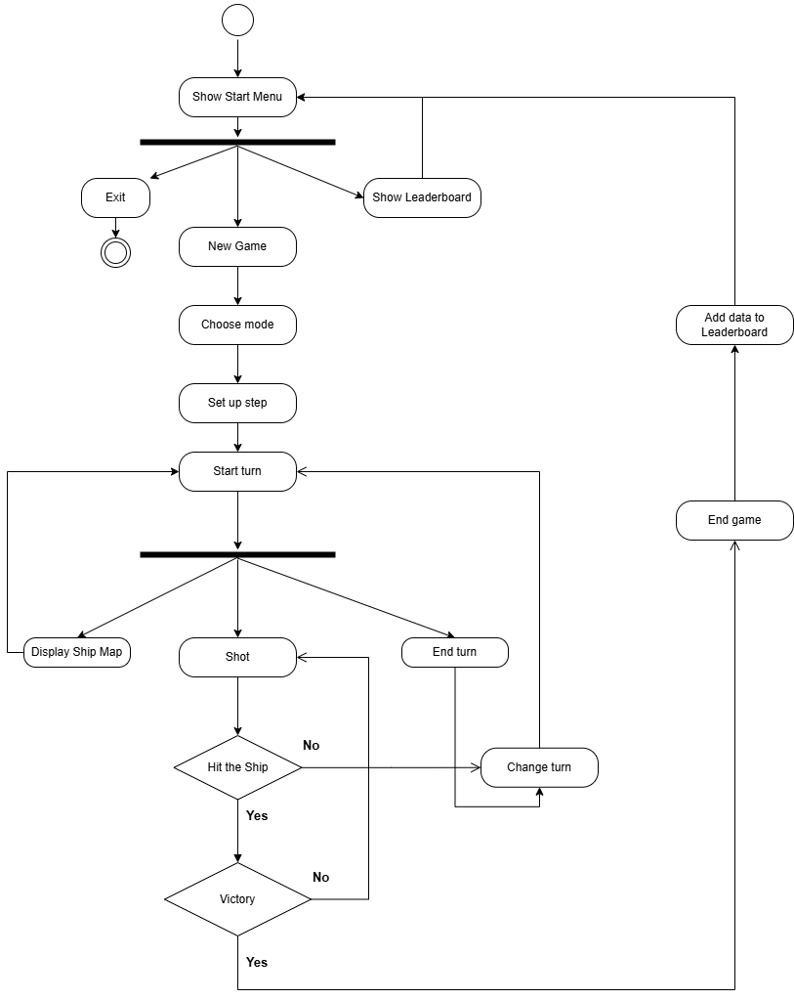
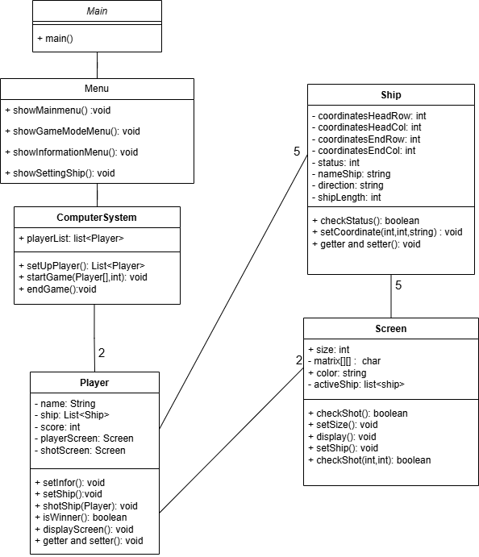
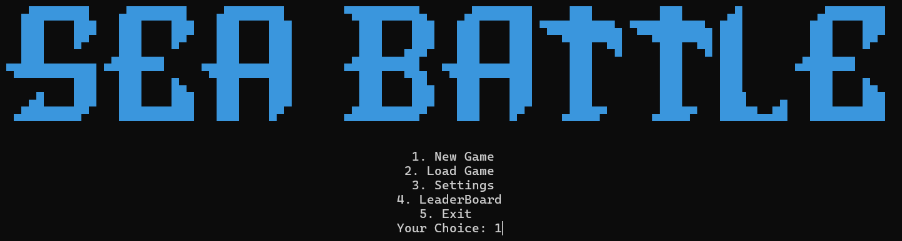
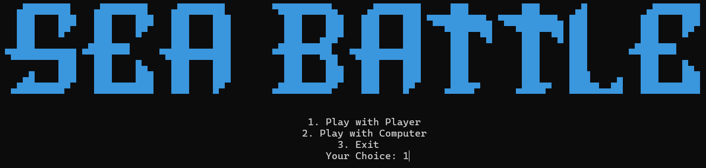
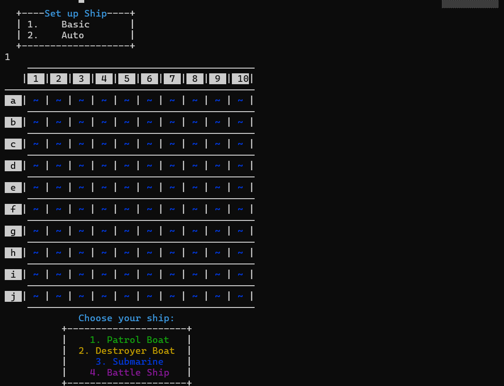
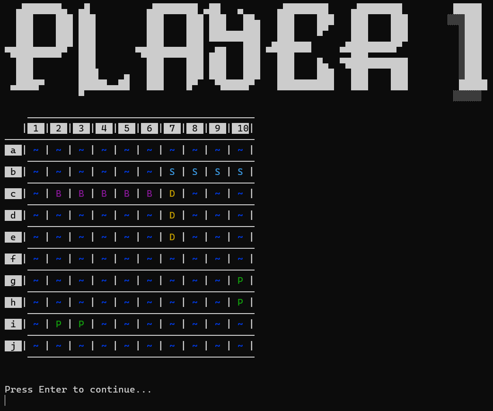
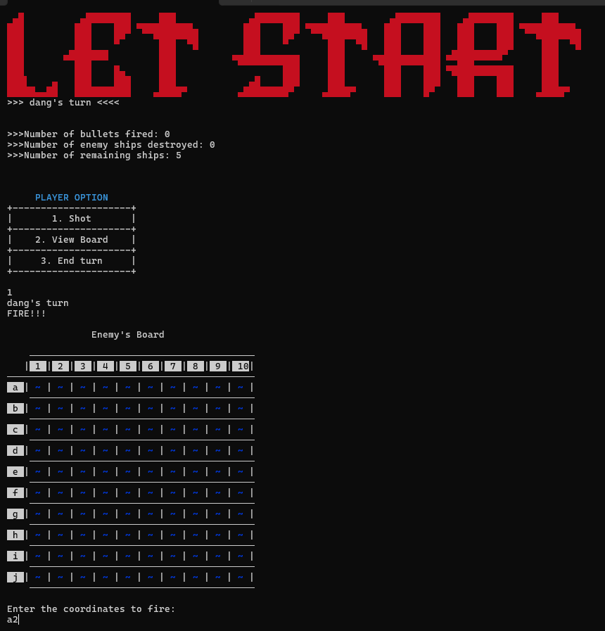
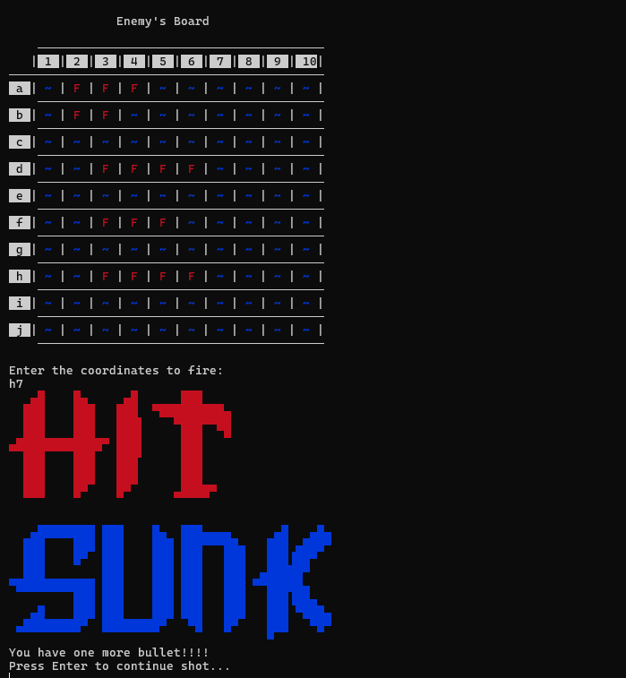
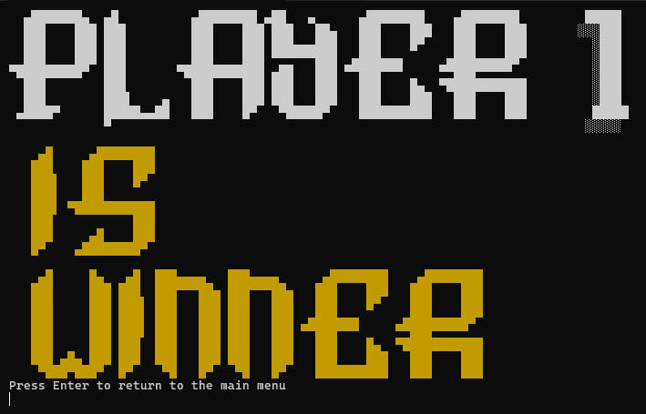

# Sea Battle

Sea Battle is a game for two players. The game is played on four grids, two for each player. The grids are typically square – usually 10×10 – and the individual squares in the grid are identified by letter and number. On one grid the player arranges ships and records the shots by the opponent. On the other grid the player records their own shots.

The project was done by [Đỗ Vũ Hải Đăng](https://github.com/DarkJyn), in the course of Object Oriented Programming at [ProPTIT](https://proptit.com/).

## Tech Stack

- [Java](https://www.java.com/en/) 


## Installation

- Clone the repo
- Open: Product \ GameLauncher (Batch File).
- Enjoy the game

## Software Design (UML)
### Activity Diagram

### Class Diagram

## Demo Gameplay
[Video Demo Gameplay](https://youtu.be/6vsXH8S1ecc)
### Images:







## Usage
- Project Structure
```bash


├── src
│   ├── Main.java
│   ├── ObjectList
│   │   ├── Player.java
│   │   ├── Screen.java
│   │   ├── Ship.java
│   │   └── ShipManager.java
│   ├── System
│   │   ├── ComputerSystem.java
│   │   ├── InputSystem.java
│   │   ├── MenuList.java
│   │   └── Terminal.java
```
## Contributing

Pull requests are welcome. For major changes, please open an issue first
to discuss what you would like to change.

Please make sure to update tests as appropriate.

## License

[MIT](https://choosealicense.com/licenses/mit/)